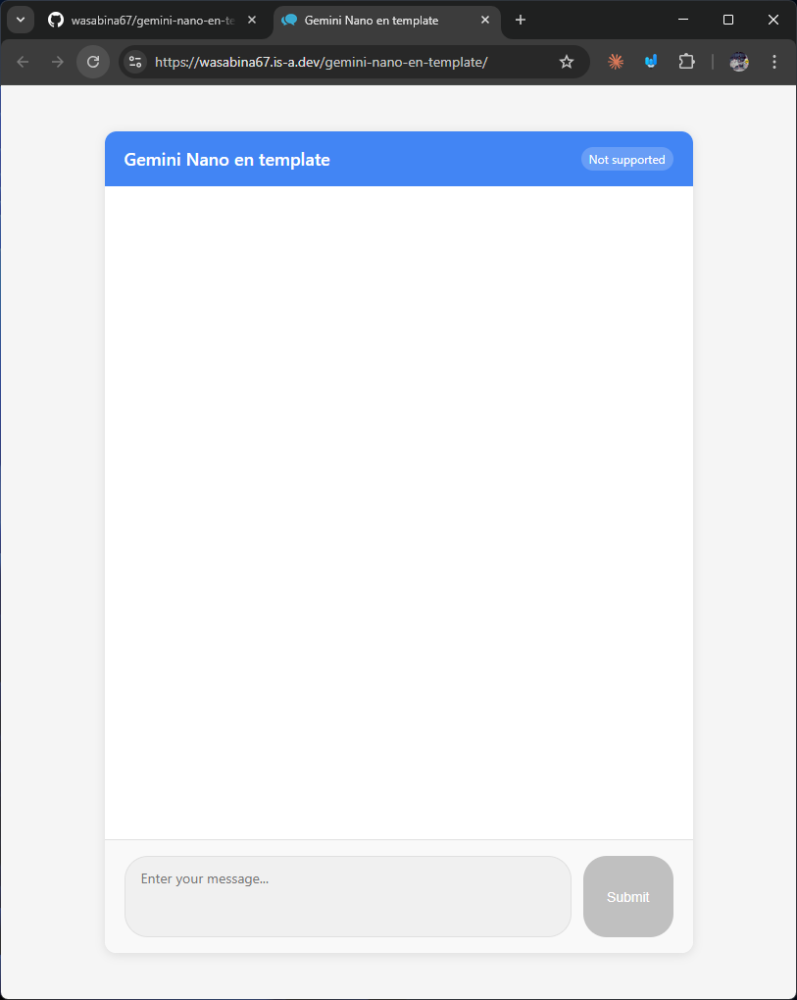
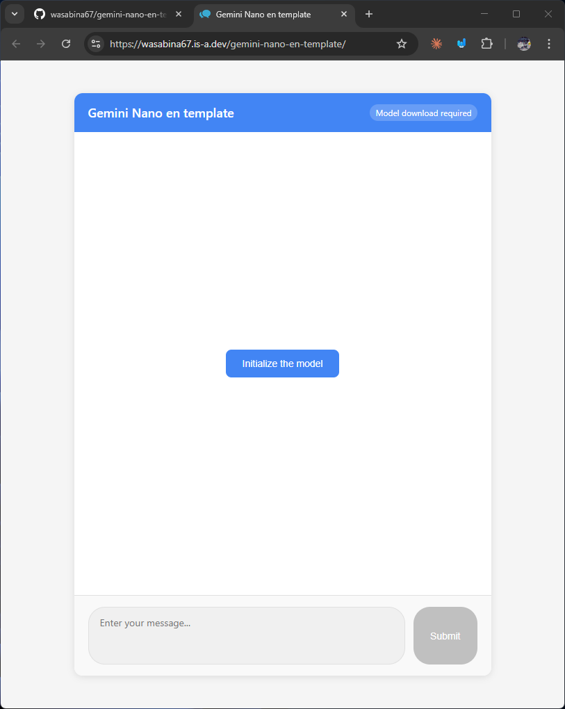
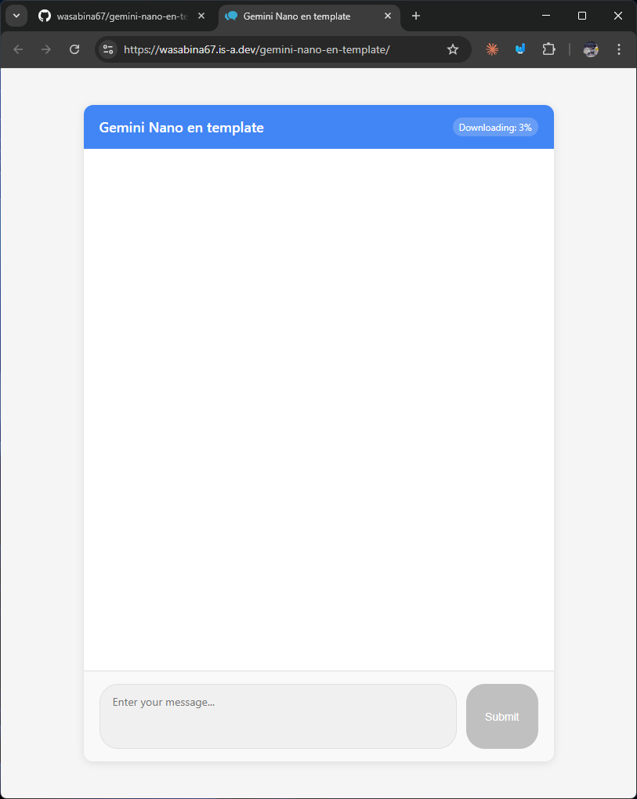

# gemini-nano-en-template
Gemini Nano en template

[The Prompt API  |  AI on Chrome  |  Chrome for Developers](https://developer.chrome.com/docs/ai/prompt-api)

<details>
<summary>Demo</summary>

https://github.com/user-attachments/assets/2a36eebf-aa17-482a-b4ba-32ef7ef2f35c

</details>

## Setup


```
chrome://flags/#optimization-guide-on-device-model
```
-> Enabled

```
chrome://flags/#prompt-api-for-gemini-nano-multimodal-input
```
-> Enabled



## Install
```bash
npm i
```

## Run
```bash
node server.js
```
